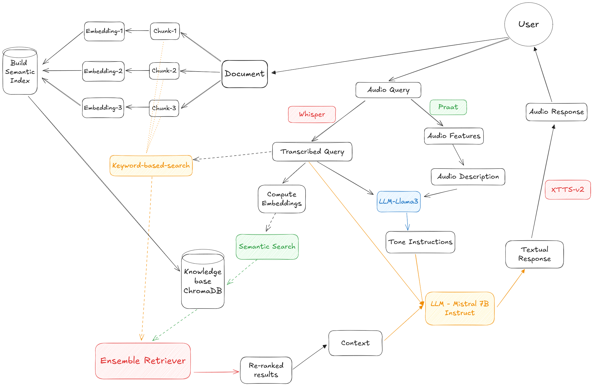

# SVARAG: Sentiment-Aware Voice-Activated Retrieval-Augmented Generation Chatbot


**SVARAG** (Sentiment-Aware Voice-Activated Retrieval-Augmented Generation Chatbot) is an advanced AI system designed to process voice queries, analyze sentiment, retrieve relevant information, and generate responses with an appropriate tone. By integrating speech recognition, sentiment analysis, retrieval-augmented generation (RAG), and text-to-speech (TTS), SVARAG provides a conversational AI experience that is both contextually aware and emotionally intelligent.

---
## 📌 **Workflow Diagram**  
**Architecture of the system**:


---
## 🔑 **Key Features**

🎙️ **Voice-Activated Query Processing**

- Users can upload or record audio to interact with the chatbot.
- Uses Whisper for speech-to-text transcription.

🧠 **Multimodal Sentiment-Aware Responses**

- Extracts vocal features (pitch, volume, articulation rate) and generates natural language descriptions of the audio.
- Passes both the audio description and transcribed text to an LLM to determine the appropriate Tone Instructions for the final response.
- Ensures responses are emotionally aligned and contextually relevant based on both speech characteristics and text content.

🔎 **Retrieval-Augmented Generation (RAG) for Intelligent Responses**
- Retrieves relevant information from uploaded documents.
- Uses hybrid search: vector-based retrieval (ChromaDB) + keyword-based search (BM25).
- Generates factually accurate, context-aware responses using Mistral-7B LLM.

🔊 **Realistic Text-to-Speech (TTS) Output**
- Converts responses into natural-sounding speech using XTTS-v2.
- Ensures smooth, expressive voice synthesis for a conversational experience.

⚡ **Fast & Seamless User Experience**
- Built with Streamlit for an intuitive web interface.

---

## 🚀 Installation & Setup

### 1️⃣ Clone the Repository

```commandline
git clone https://github.com/varshath-akula/SVARAG.git
cd SVARAG
```

### 2️⃣ Install FFmpeg (Required for Whisper)
- **Run the following commands in PowerShell (Windows users):**

  - Install Chocolatey:
    ```powershell
    Set-ExecutionPolicy Bypass -Scope Process -Force; [System.Net.ServicePointManager]::SecurityProtocol = [System.Net.ServicePointManager]::SecurityProtocol -bor 3072; iex ((New-Object System.Net.WebClient).DownloadString('https://chocolatey.org/install.ps1'))
    ```
  - After installing Chocolatey, use it to install ffmpeg:
    ```powershell
    choco install ffmpeg
    ```
- **Linux/Mac users can install FFmpeg using:**
```bash
sudo apt install ffmpeg  # Ubuntu/Debian  
brew install ffmpeg      # macOS (Homebrew)
```
### 3️⃣ Create a Virtual Environment
```bash
python -m venv venv
source venv/bin/activate  # On macOS/Linux
venv\Scripts\activate     # On Windows
```
### 4️⃣ Install Dependencies
```commandline
pip install -r requirements.txt
```

### 5️⃣ Set Up API Keys
Create a .env file in the root directory and add your API keys:
```
HUGGINGFACE_API_KEY = your_huggingface_key
GROQ_API_KEY = your_groq_key
```
### 6️⃣ Change the Working Directory to `app` and Run the Streamlit App
```commandline
cd app
streamlit run app.py
```

##### ⚠ **Note:** While loading the **Text-to-Speech model**, you may be prompted to accept a **non-commercial license** in the terminal.
##### Type `y` and press **Enter** to proceed.


---
## 🎮 Usage Guide
#### 1️⃣ Upload a PDF document → SVARAG processes it for retrieval.
#### 2️⃣ Choose a query mode:
- Upload a WAV file
- Record a voice query directly
#### 3️⃣ SVARAG processes your query:
- Transcribes speech
- Analyzes sentiment
- Retrieves relevant information
- Generates a contextually aware response
- Converts the response into speech
#### 4️⃣ Listen to the AI-generated response 🎧

---
## 📚 References  

This project utilizes a **multimodal sentiment analysis** approach inspired by the following research paper:  

📄 **Beyond Silent Letters: Amplifying LLMs in Emotion Recognition with Vocal Nuances**  
✍️ **Zehui Wu, Ziwei Gong, Lin Ai, Pengyuan Shi, Kaan Donbekci, Julia Hirschberg**  
🏛️ **Department of Computer Science, Columbia University**  
📧 {zw2804, zg2272, la2734, ps3391, kd2939}@columbia.edu, julia@cs.columbia.edu  

🔗 [Link to the Research Paper] (https://arxiv.org/abs/2407.21315)  

This paper explores **how vocal nuances (pitch, intensity, articulation rate, etc.) can enhance LLM-based emotion recognition**. Our sentiment analysis module adopts similar methodologies, converting vocal features into **natural language descriptions** to guide the **LLM in generating sentiment-aware responses**.
